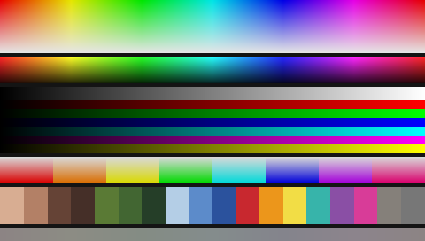
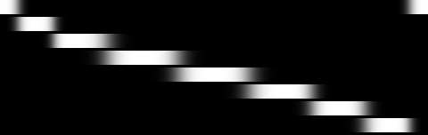
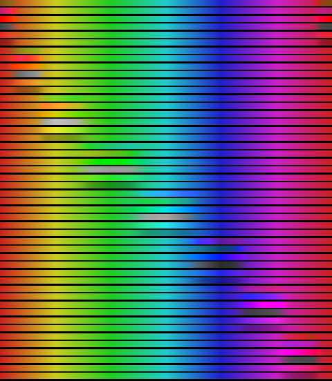
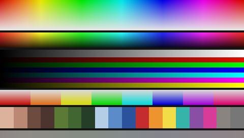
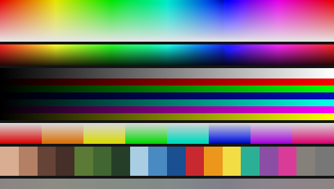
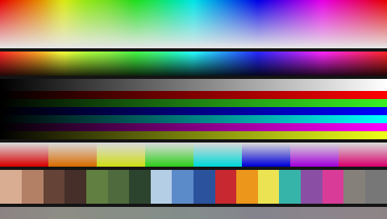

# Lightroom-style Colour Mixer for DaVinci Resolve Studio

`Lightroom_Color_Mixer.dctl` is a photographic colour mixer for DaVinci Resolve
Studio: independent **Hue / Saturation / Luminance** for eight overlapping
colour regions, plus global Saturation, Vibrance and a set of protection
controls — 24 per-colour controls and 11 supporting ones in total.

It is an **independent implementation inspired by the behaviour** of Lightroom's
Colour Mixer / HSL panel. It is not Adobe's algorithm, no Adobe code or binary
was used or inspected, and it is not numerically equivalent to Lightroom. See
[How it compares to Lightroom](#how-it-compares-to-lightroom).



---

## Contents

- [What it does](#what-it-does)
- [How it compares to Lightroom](#how-it-compares-to-lightroom)
- [Installation](#installation)
- [Controls](#controls)
- [Colour-space assumptions](#colour-space-assumptions)
- [Example workflows](#example-workflows)
- [Known limitations](#known-limitations)
- [Performance](#performance)
- [Testing](#testing)
- [Project layout](#project-layout)

---

## What it does

Eight colour regions — **Red, Orange, Yellow, Green, Aqua, Blue, Purple,
Magenta** — each with Hue, Saturation and Luminance on a −100…+100 scale, all
defaulting to 0.

The design goals, and how they are met:

**Region selection is a continuous cross-fade, never a threshold.** The eight
region centres (0°, 30°, 60°, 120°, 180°, 240°, 285°, 330°) divide the hue
circle into eight arcs. Inside an arc only the two bounding regions are active
and they cross-fade; everywhere on the circle the eight weights sum to exactly
1. A yellow-orange pixel really is *0.65 orange + 0.35 yellow*, and a pixel
sitting on a region centre is owned by that region alone, exactly as a
photographic HSL panel behaves. Because there is no threshold anywhere, there is
nothing that can band.



*The eight region weights across the hue circle (Red at the top, wrapping at
both ends), rendered by the built-in Colour Range Preview.*

**One operator, not eight stacked ones.** The eight slider triplets are blended
by those weights into a single effective (hue, saturation, luminance) triplet,
which is then applied once. Stacking eight operators would make the result
depend on their order and would pile up rounding at every region boundary;
interpolating the *parameters* instead is what keeps gradients clean.

**Each operator is chosen so that it changes one thing.**

| Operator | Method | What it preserves |
|---|---|---|
| Hue | rotation in HSV geometry: max, min and therefore value and saturation are held, only the angle moves | saturation, value |
| Saturation | chroma scaled about the pixel's own luma | luma, **exactly** — the residual `rgb − luma` has zero luma, so scaling it cannot change brightness |
| Luminance (display) | a Möbius tone response applied to the pixel's value, passed on as a common scale factor | hue and saturation exactly; black stays black and white stays white |
| Luminance (log) | a code-value offset | hue and chroma exactly; it is a true ±1 stop exposure change |
| Luminance (linear) | decode, scale, re-encode | an exact ±1 stop exposure change |

At −100 a region's Saturation reaches a true neutral. At +100 it doubles chroma
and the gamut protector takes over before anything can turn into a hard-clipped
edge.



*Every one of the 24 controls at ±100 over a hue sweep (+100 above each
divider, −100 below). Each control moves only its own part of the circle, and
each transition is smooth.*

---

## How it compares to Lightroom

| | This DCTL | Lightroom |
|---|---|---|
| Regions | 8, same names and roughly the same centres | 8 |
| Slider ranges | −100…+100, neutral at 0 | −100…+100, neutral at 0 |
| Region selection | smooth partition of unity, user-adjustable width | smooth, fixed width, exact shape undisclosed |
| Working space | the encoding you declare (display / log / scene linear), primaries untouched | a ProPhoto-primaries space with an sRGB-like tone curve |
| Numerical match | **no** — same class of behaviour, different numbers | — |
| Extra controls | Hue Falloff, Protect Neutrals, Preserve Luminance, Saturation Protection, Overall Amount, region preview | none of these |

If you need Lightroom's exact numbers, the right tool is a Lightroom-to-`.cube`
LUT exporter — several already exist. This project is deliberately the other
thing: a mixer that lives *inside* Resolve, works on live footage at any
exposure, and can be adjusted on the node while you watch the image.

---

## Installation

DCTL requires **DaVinci Resolve Studio**. The free edition cannot load DCTLs.

1. Copy `Lightroom_Color_Mixer.dctl` into Resolve's LUT folder:

   | OS | Folder |
   |---|---|
   | macOS | `/Library/Application Support/Blackmagic Design/DaVinci Resolve/LUT/` |
   | Windows | `C:\ProgramData\Blackmagic Design\DaVinci Resolve\Support\LUT\` |
   | Linux | `/opt/resolve/LUT/` (or `/home/resolve/LUT/` on some installs) |

   A subfolder is fine — `LUT/DCTL/Lightroom_Color_Mixer.dctl` shows up as a
   sub-menu. The file is entirely self-contained; there is nothing else to copy.

2. In the Color page, add the effect to a node:
   **Effects → ResolveFX Color → DCTL**, drag it onto a node, then pick
   *Lightroom Color Mixer* from the **DCTL List** dropdown in the Inspector.

3. Set **Input Encoding** to match what the node is being fed. This matters —
   see [Colour-space assumptions](#colour-space-assumptions).

**Reloading after an edit.** Resolve caches the DCTL list and the compiled
kernel. After changing the file, either
**Project Settings → Color Management → Lookup Tables → Update Lists**, or
re-pick the DCTL in the DCTL List dropdown. If a change still does not appear,
restart Resolve. Compilation errors are reported in the Console
(**Workspace → Console**), which is the first place to look if the node turns
black.

---

## Controls

### Input Encoding

What the node is being handed. Changes how Luminance works and where hue is
measured. See [Colour-space assumptions](#colour-space-assumptions).

### Global

| Control | Range | Default | What it does |
|---|---|---|---|
| **Global Saturation** | −100…+100 | 0 | A plain chroma scale about luma, independent of hue. −100 is a true monochrome conversion, +100 doubles chroma. Neutrals are untouched at any setting, and hue never shifts. |
| **Vibrance** | −100…+100 | 0 | A saturation-aware chroma scale. Positive vibrance weights the move by `(1 − saturation)^1.5`, so a weak colour is lifted several times more than one that is already saturated, and holds back by up to 40% over the skin hue band. Negative vibrance keeps proportionally more of the strongest colours than Global Saturation would. It is a different curve, not a re-labelled saturation. |
| **Overall Amount** | 0…100 | 100 | Cross-fades the finished result against the original pixel. At 0 the output is bit-for-bit the input. This is a blend of images, not a scaling of the slider values, so the character of the grade does not change as you pull it back. |

### Per colour — Red, Orange, Yellow, Green, Aqua, Blue, Purple, Magenta

| Control | Range | Default | What it does |
|---|---|---|---|
| **Hue** | −100…+100 | 0 | Rotates the region's hue by up to ±30°, which moves a colour roughly one photographic hue band. The rotation is weighted by the region's membership, wraps correctly through 360°, and is a no-op on neutrals. |
| **Saturation** | −100…+100 | 0 | Scales the region's chroma about its own luma: −100 reaches a true neutral, +100 doubles it. Brightness does not change. |
| **Luminance** | −100…+100 | 0 | Brightens or darkens the region by up to about one stop without moving hue or saturation. |

### Advanced

| Control | Range | Default | What it does |
|---|---|---|---|
| **Protect Neutrals** | 0…100 | 35 | Sets the saturation below which the per-colour controls fade out, from 5% at 0 to 50% at 100. Grey, white, black and washed-out footage stay put while genuinely coloured pixels are still fully addressed. *Exact neutrals are never modified at any setting* — the fade reaches zero at zero saturation regardless. |
| **Preserve Luminance** | 0…100 | 75 | Restores the brightness that a hue rotation moved. Rotating a hue changes its luma even when value and saturation are held (yellow is far brighter than blue at the same value); this puts it back. It runs before the Luminance sliders, so it never fights them. |
| **Hue Falloff** | 0…100 | 50 | The width and softness of the region cross-fade. 0 is tightly targeted, 100 is a broad linear cross-fade, 50 is equivalent to a smoothstep. The blend always passes through 0.5 at an arc midpoint and always has a continuous derivative, so no setting can create a hard edge. |
| **Saturation Protection** | 0…100 | 50 | A one-sided soft gamut compressor. It limits how far the mixer may *raise* saturation: at 0 it permits saturation up to 2.0, at 100 it holds the result inside the gamut (saturation 1.0, the point where a channel would go negative). It is one-sided by design — a pixel whose saturation the mixer did not raise is returned untouched, so the control can never quietly desaturate material you did not ask it to change. |
| **Colour Range Preview** | Off / Region Mask / Isolate Region | Off | A diagnostic. *Region Mask* renders the selected region's weight as greyscale. *Isolate Region* keeps the selected region in colour and renders everything else dimmed and monochrome. |
| **Preview Region** | Red…Magenta | Red | Which region the preview shows. |
| **Bypass** | on / off | off | Returns the input immediately. |

**A useful combination:** Global Saturation −100 with the eight Luminance
sliders gives you a black-and-white channel mixer — the regions are still
selected from the original colour, so you can darken a sky and lift skin in a
monochrome conversion.

---

## Colour-space assumptions

Hue is not a physical quantity. The hue *angle* of a pixel depends on the RGB
encoding it is measured in, so "skin sits near 30°" is only true in a
perceptually encoded space. The identical pixel in scene-linear RGB measures a
much lower angle and would be classified as red rather than orange. Any HSL tool
that ignores this misbehaves on log and linear footage — so this one asks.

**Input Encoding** declares what the node is being fed:

| Setting | Expects | How it works |
|---|---|---|
| **Display Rec.709 sRGB** *(default)* | display-referred, perceptually encoded, nominal 0–1 (Rec.709, sRGB, Rec.1886, a P3 display space, or the output of a CST / display LUT) | The mixer runs directly on the values. Luminance uses a tone response that fixes both black and white, so it cannot blow a highlight out of the display range. |
| **Log direct** | any log encoding — DaVinci Intermediate, ACEScct, ARRI LogC, Sony S-Log3, Panasonic V-Log, RED Log3G10 … | Log curves are already roughly perceptually uniform, so the mixer runs directly on the code values. Luminance is applied as a code-value offset of 0.0733 per 100, which is one stop in a DI/LogC-slope curve and close to it in the others. |
| **Scene Linear** | scene-linear RGB | Encoded to DaVinci Intermediate for processing and decoded back afterwards, so hue selection stays perceptual. Luminance is decoded, scaled and re-encoded, making it an exact ±1 stop exposure change. |

Two things this deliberately does **not** do:

- **Primaries are never converted.** Hue angles are measured in whatever
  primaries you feed in. With Rec.709, P3 or DaVinci Wide Gamut the eight named
  regions land where you expect. With a very wide encoding such as ACES AP0 the
  angles are noticeably different — put a Colour Space Transform in front of the
  node and its inverse behind it if you want the named regions to match the
  standard photographic hue wheel. Sandwiching the mixer between CSTs is the
  normal professional way to pin down its working space, and it is the
  recommended workflow for anything more exotic than the three options above.
- **Luma is measured with Rec.709 weights** (0.2126 / 0.7152 / 0.0722) in the
  working encoding. For other primaries this is an approximation. It is used
  only as a lightness metric — as the pivot for chroma scaling and as the target
  for Preserve Luminance — and never leaves the pixel's own colour space.

HDR and out-of-range values are handled rather than clamped. The saturation
metric is scale invariant, so it reads the same at any exposure; the display
Luminance curve continues above white as a plain gain instead of hitting the
Möbius pole; and nothing in the pipeline clamps intermediate values, so a value
above 1 or slightly below 0 travels through and comes out the other side.

---

## Example workflows

Starting points, not recipes — every image is different.

### Skin

```
Orange   Hue  −12    Saturation  −14    Luminance  +22
Red      Hue   +8    Saturation   −8    Luminance  +10
```

Opens skin up and takes the edge off it. Orange Hue negative pulls skin towards
red (warmer, less yellow); positive pushes it towards yellow (more tanned, more
sallow if overdone). Keep Protect Neutrals at or above the default so that the
grey and near-neutral parts of a face and its background do not drift with it.



### Sky

```
Blue     Hue  −18    Saturation  +28    Luminance  −30
Aqua     Hue  −25    Saturation  +10    Luminance  −15
```

Deepens a sky and takes the cyan out of it. Blue Hue negative moves the sky
towards cyan, positive towards purple. Pulling Aqua along with Blue is usually
necessary: a real sky covers both regions, and moving only one leaves a visible
seam across a gradient.



### Foliage

```
Green    Hue  −22    Saturation  −18    Luminance  +12
Yellow   Hue  +15    Saturation  −10    Luminance   +8
```

The classic cinematic foliage move: pull green towards yellow, push yellow
towards green, and desaturate both. Foliage is nearly always spread across the
yellow and green regions, so treat them as a pair.



---

## Known limitations

- **It is not Lightroom.** Same class of behaviour, different numbers. Do not
  expect a Lightroom preset to transfer by copying slider values.
- **Primaries are not converted.** The named regions assume Rec.709-like
  primaries; with much wider primaries the hue angles shift. Use a CST sandwich.
- **The DCTL cannot know its own colour space.** Resolve does not tell a DCTL
  what it is being handed, so Input Encoding has to be set by hand. Setting it
  wrong is not destructive — it mainly changes how Luminance behaves — but it
  will not feel right.
- **`Log direct` treats all log curves alike.** One stop is taken to be 0.0733
  code values, which is exact for DaVinci Intermediate and close for LogC,
  S-Log3 and V-Log. If you need an exact stop in some other curve, work in
  `Scene Linear` between CSTs.
- **Resolve's DCTL UI has no group headers**, so all 35 controls appear as one
  flat list in the Inspector. The labels are prefixed with the region name and
  ordered Global → the eight colours → Advanced.
- **±100 is deliberately not extreme.** Hue tops out at ±30° and Luminance at
  about ±1 stop. This is a photographic range; stack a second node if you need
  more.
- **Region Mask preview outputs 0–1 greyscale**, which reads as super-white in
  a log timeline. It is a diagnostic, not an image.

---

## Performance

The pixel path is a few dozen arithmetic operations plus a small, fixed number
of transcendentals: two `powf` for the region cross-fade, and between zero and
seven `exp2f` / `log2f` / `expf` depending on the input encoding and on which
operators the pixel actually reaches. There are no loops, no arrays, no texture
lookups and no dynamic indexing.

What keeps it cheap:

- The eight slider triplets collapse into one triplet with eight multiply-adds
  before any colour maths runs, so the operator chain executes **once**, not
  eight times.
- Only two region weights can be non-zero, so the weighting costs eight
  comparisons rather than eight falloff evaluations.
- Every operator is skipped by an explicit test at its neutral value. In a
  typical grade — two or three regions in use — most pixels take the short path.
- With every control at its default and Bypass off, a single summed test detects
  that there is nothing to do and returns the input before any conversion runs.
- `Amount = 0` and `Bypass` return immediately.
- Transfer-function work only happens in `Scene Linear` mode, and the
  decode/scale/encode inside Luminance only runs for pixels the Luminance
  sliders actually reach.

The branches are on values that are uniform across the frame (slider states) or
that vary slowly (hue region), so warp divergence stays low.

---

## Testing

```
./tests/build.sh          # compile the harness around the real .dctl
python3 tests/run_tests.py
python3 tests/make_test_images.py
```

`tests/build.sh` also compiles the DCTL a second time as **C99**. Resolve
translates a DCTL into CUDA C, OpenCL C or Metal — none of which are C++ — so
building it once under a C compiler catches anything only a C++ compiler would
have accepted. Relatedly, no UI parameter is ever read from a helper function;
every one of them is read in `transform()` and passed down as an argument, which
is the portable pattern across all three backends.

`tests/dctl_shim.h` emulates the DCTL environment — `__DEVICE__`, `float3`,
`make_float3`, `DEFINE_UI_PARAMS` and the `_`-prefixed intrinsics — closely
enough that `Lightroom_Color_Mixer.dctl` can be `#include`d **unmodified** into
a C++ program and run on the CPU. The test suite therefore exercises the file
that ships, not a copy of it, and the build runs with `-Wall -Wextra -Werror`.

`reference/color_mixer_reference.py` is an independent, dependency-free
implementation of the same maths, used to cross-check the compiled DCTL and to
render the images in `tests/images`.

**Results — 806 checks, all passing.**

| Area | What is checked | Result |
|---|---|---|
| Compilation | builds clean as C++11 **and** as C99, both with `-Wall -Wextra -Werror` | pass |
| Source validation | self-contained (no `#include`), correct `transform()` signature, every function `__DEVICE__`, all 35 UI declarations with the right types / defaults / ranges, combo enumerations in sync with the shim | pass |
| DCTL vs. reference | 32 parameter sets × 776 pixels, including HDR, negative and near-neutral values | worst relative disagreement **2.4 × 10⁻⁷** — 32-bit float rounding |
| Identity | all controls neutral, in all three encodings | **bit exact** |
| `Amount = 0`, `Bypass` | with all 24 sliders at their extremes | **bit exact** |
| `Amount` cross-fade | is a true blend of input and full-strength output | max error 10⁻⁶ |
| Locality | a blue-only adjustment leaves red pixels **bit exactly** unchanged | pass |
| All 24 controls | each hue reaches its predicted angle within 1°; each saturation reaches a true neutral at −100 and is monotonic; each luminance is monotonic and shifts hue by < 0.05° and saturation by < 0.002; none of them move neutrals or the opposite hue | pass |
| Region weights | sum to 1 to within 10⁻⁹ at 36 000 hue angles × 5 falloff settings; a colour on a centre is owned by that region alone; at most two regions overlap | pass |
| Continuity | hue swept at 0.05°, then 4× finer, with neighbouring regions at opposing extremes. The largest step shrinks by ×0.25–0.26 when the sampling is refined, which is proportional — the signature of a continuous function. A discontinuity would not shrink at all. | pass |
| Global saturation | −100 fully desaturates, +100 raises chroma everywhere, hue shifts < 0.05°, neutrals untouched | pass |
| Vibrance | lifts a weak colour > 1.5× more than a saturated one, holds back over skin, is not equivalent to Global Saturation, and keeps more of the strongest colours when negative | pass |
| Protect Neutrals | cuts the move on a near-neutral pixel to under 35%; exact neutrals never move at any setting | pass |
| Gamut | at protection 100 no in-gamut pixel is left with a negative channel; at 0 excursions are wider; display Luminance +100 keeps white at white | pass |
| Stability | 27 extreme slider combinations × 2 falloffs × 2 protection settings over 776 pixels, plus hostile inputs (10⁻³⁰, 10⁶, negative, exact black and white) in all three encodings | no NaN, no infinity, nothing unbounded |
| Encodings | DI round trip to 10⁻⁶; log Luminance +100 offsets by exactly one stop; linear Luminance scales all channels equally to 2×; a warm linear pixel is correctly classified as orange | pass |

The images in `tests/images` are rendered by the reference implementation from a
chart containing a full hue circle at falling saturation, a hue circle at
falling value, grey / RGB / CMY ramps, a saturation gradient for each region
centre, 18 photographic patches (skin, foliage, sky, saturated colours,
neutrals) and a near-neutral sweep at 6% saturation.

`tests/images/10_alternating_extremes.png` is the stress case: neighbouring
regions pushed in opposite directions with all 24 sliders at ±100 and neutral
protection off. The gradients stay smooth.

---

## Project layout

```
Lightroom_Color_Mixer.dctl   the DCTL — this is the only file Resolve needs
README.md
LICENSE
reference/
  color_mixer_reference.py   dependency-free Python implementation of the maths
tests/
  dctl_shim.h                host emulation of the DCTL environment
  dctl_harness.cpp           #includes the real .dctl and runs it on the CPU
  dctl_c_check.c             the same include, compiled as C99 for portability
  build.sh                   builds both, with -Wall -Wextra -Werror
  run_tests.py               the test suite
  make_test_images.py        renders the charts and examples
  images/                    generated charts and example grades
```

---

## Licence and attribution

MIT. This is an independent implementation built from standard colour-science
techniques and observable photographic behaviour. It contains no Adobe code,
data or assets, and nothing was obtained by reverse engineering. "Lightroom" is
a trademark of Adobe Inc.; it is used here only to describe the class of tool
this resembles.
